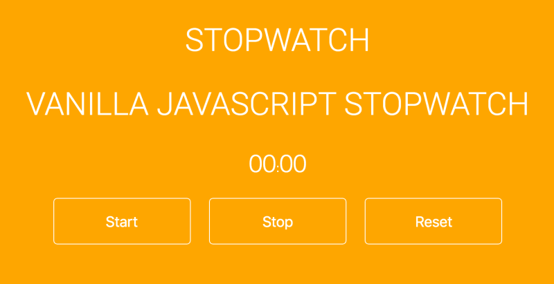

### VANILLA JAVASCRIPT STOPWATCH

Done with DOM and style by simple CSS.

Coding a JavaScript stopwatch is an easy little project you can build in one day even as a beginner. Your stopwatch needs three buttons for user interaction:

1.  Start
2.  Stop
3.  Reset

Create a nice layout with simple css to make it look pretty.
